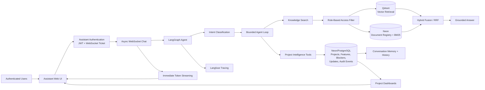
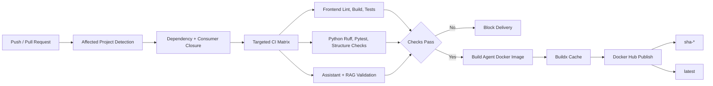

# Workalaya Agentic Assistant

Technical presentation context for the Workalaya Agentic Assistant. This
five-slide narrative is written for engineering audiences and separates the
assistant runtime, project-scoped MCP integration, CI/CD delivery, and demo
workflow.

## Slide 1 — Problem and System Overview

### Tracking Status Across Multiple Client Projects

Companies managing several client projects struggle to track progress across
distributed development teams, repositories, coding tools, and documentation.

Project information becomes fragmented, stale, and difficult to compare.
Workalaya connects developer workflows to structured, access-controlled
project intelligence:

```text
Developers using coding agents
        ↓
Project-scoped MCP server
        ↓
Normalized PostgreSQL project state
        ↓
LangGraph assistant + hybrid RAG
        ↓
Dashboard and conversational intelligence
```

### Presenter context

Workalaya is an internal project-intelligence system. It captures confirmed
project changes through the tools developers already use, stores structured
state separately from documentation, and gives authorized users a searchable
and conversational view of project health.

## Slide 2 — Agent Architecture and Delivered Extensions

### Role-Aware Agent Runtime and Hybrid RAG



### Delivered extensions shown by the architecture

- Assistant authentication and role-based access.
- Project dashboards and normalized project state.
- Features, blockers, updates, and audit events in PostgreSQL.
- Hybrid RAG using Qdrant and Neon.
- Persistent conversation memory and history.
- Async WebSocket streaming of workflow steps and generated tokens.
- Langfuse tracing for agent and retrieval execution.

### Key engineering decisions

- PostgreSQL is authoritative for structured project state.
- RAG supplies documentation context and evidence.
- RBAC filters are derived server-side from verified roles.
- The model cannot choose its own project or access scope.
- Agent loops, tool calls, and LLM requests are bounded.

### Presenter context

The important separation is between facts and context. Project tools read
structured state, while the RAG tool finds supporting internal documentation.
The assistant combines them only after the server has resolved the caller's
access filter.

## Slide 3 — Project-Scoped MCP Integration

### Secure Project Updates From Developer Coding Agents

Example Claude Code connection:

```bash
claude mcp add --transport http project-status \
  https://assistant.example.com/mcp \
  --header "Authorization: Bearer $PROJECT_MCP_TOKEN"
```

Authorization flow:

```text
Bearer token
    ↓
Hash lookup
    ↓
ProjectMcpContext
    ↓
Project-bound SQL predicates
    ↓
MCP tools
```

### Security boundary

- Human dashboard access uses assistant JWTs.
- Coding-agent access uses separate opaque project credentials.
- Credentials are stored as hashes and support expiration and revocation.
- Each credential is bound to one project.
- Project scope is resolved by the server.
- A model-supplied `project_id` is never treated as authority.
- Authentication failures and project mutations are audited.

### MCP tool groups

- Read project context and historical updates.
- Create or update features.
- Create or resolve blockers.
- Submit confirmed daily updates.

The MCP surface exposes controlled project operations rather than generic SQL
or cross-project access.

### Presenter context

The credential is deliberately narrower than a normal platform identity. A
developer's coding agent can update the project it is authorized for, but the
agent cannot use its prompt or tool arguments to switch projects.

## Slide 4 — CI/CD Pipeline

### Dependency-Aware Delivery for the Monorepo



### Pipeline behavior

- Changed projects and transitive consumers are detected automatically.
- Documentation-only changes avoid unnecessary project fan-out.
- CI metadata changes still trigger validation.
- Node projects use pnpm; Python projects use uv.
- The agent image is built from the repository root because it consumes
  shared workspace libraries.
- Buildx enables cache-capable Docker builds.
- Successful agent-impacting changes publish `sha-*` and `latest` Docker Hub
  tags.
- The frontend deployment target is Vercel; the containerized backend is
  designed for Render deployment.

### Presenter context

The CI design follows dependency impact. A change in a shared package should
validate its consumers, while documentation-only changes should not trigger
every application check.

## Slide 5 — Technical Demo

### From Developer Activity to Project Intelligence

1. Open the project dashboard.
2. Connect a developer's coding agent to the MCP endpoint.
3. Read the authenticated project context.
4. Submit a confirmed feature or blocker update.
5. Verify the normalized state in PostgreSQL-backed project views.
6. Ask the assistant what changed, what is blocked, and what needs attention.
7. Show LangGraph combining project tools with RBAC-filtered documentation.
8. Show tokens streaming into the UI immediately.
9. Reopen a previous conversation from the history panel.
10. Show the final evidence-backed response.

### Closing message

Workalaya turns distributed developer activity and internal documentation into
scoped, traceable, and queryable project intelligence.
